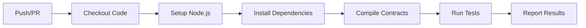
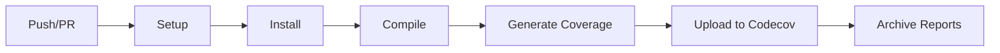
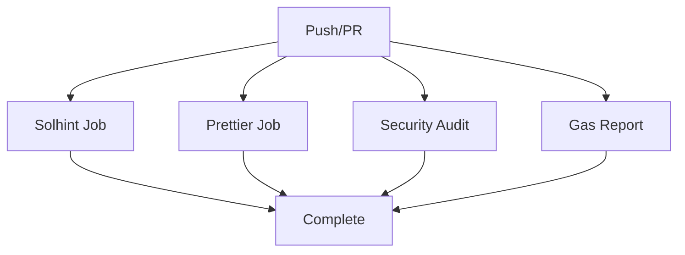

# CI/CD Pipeline Guide - Anonymous Court Investigation System

## 📋 Table of Contents

- [Overview](#overview)
- [GitHub Actions Workflows](#github-actions-workflows)
- [Configuration Files](#configuration-files)
- [Setup Instructions](#setup-instructions)
- [Workflow Details](#workflow-details)
- [Code Quality Checks](#code-quality-checks)
- [Troubleshooting](#troubleshooting)

## 🎯 Overview

This project implements a comprehensive CI/CD pipeline using **GitHub Actions** with automated testing, code coverage, security audits, and code quality checks.

### Pipeline Features

✅ **Automated Testing** - Run tests on every push and pull request
✅ **Multi-version Support** - Test on Node.js 18.x and 20.x
✅ **Code Coverage** - Track coverage with Codecov integration
✅ **Security Audits** - npm audit for dependency vulnerabilities
✅ **Code Quality** - Solhint linting for Solidity code
✅ **Code Formatting** - Prettier checks for consistent style
✅ **Gas Reporting** - Track gas usage for contract functions

## 🔄 GitHub Actions Workflows

### 1. Test Suite (`test.yml`)

**Triggers:**
- Push to `main` or `develop` branches
- Pull requests to `main` or `develop` branches

**What it does:**
- Runs on Node.js 18.x and 20.x
- Installs dependencies
- Compiles smart contracts
- Executes full test suite
- Reports test results

**Configuration:**
```yaml
on:
  push:
    branches: [main, develop]
  pull_request:
    branches: [main, develop]

jobs:
  test:
    strategy:
      matrix:
        node-version: [18.x, 20.x]
```

**Status Badge:**
```markdown

```

### 2. Code Coverage (`coverage.yml`)

**Triggers:**
- Push to `main` or `develop` branches
- Pull requests to `main` or `develop` branches

**What it does:**
- Generates coverage report
- Uploads to Codecov
- Archives coverage artifacts
- Checks coverage thresholds

**Requirements:**
- `CODECOV_TOKEN` secret in repository settings

**Status Badge:**
```markdown
[](https://codecov.io/gh/YOUR_USERNAME/YOUR_REPO)
```

### 3. Security & Code Quality (`security.yml`)

**Triggers:**
- Push to `main` or `develop` branches
- Pull requests to `main` or `develop` branches

**What it does:**
- **Solhint**: Lint Solidity code for best practices
- **Prettier**: Check code formatting
- **npm audit**: Security vulnerability scanning
- **Gas Report**: Generate gas usage analysis

**Jobs:**
1. `solhint` - Solidity linting
2. `prettier` - Code formatting check
3. `security-audit` - Dependency security audit
4. `gas-report` - Gas usage reporting

## ⚙️ Configuration Files

### 1. Solhint Configuration (`.solhint.json`)

Linting rules for Solidity code:

```json
{
  "extends": "solhint:recommended",
  "rules": {
    "compiler-version": ["error", "^0.8.0"],
    "func-visibility": ["warn", { "ignoreConstructors": true }],
    "max-line-length": ["warn", 120],
    "code-complexity": ["warn", 10],
    "function-max-lines": ["warn", 100]
  }
}
```

**Key Rules:**
- Compiler version enforcement
- Function visibility checks
- Line length limits (120 chars)
- Code complexity warnings
- Function length limits (100 lines)

### 2. Solhint Ignore (`.solhintignore`)

Files excluded from linting:

```
node_modules/
artifacts/
cache/
coverage/
typechain-types/
```

### 3. Prettier Configuration (`.prettierrc.json`)

Code formatting rules:

```json
{
  "overrides": [
    {
      "files": "*.sol",
      "options": {
        "printWidth": 120,
        "tabWidth": 4
      }
    },
    {
      "files": "*.js",
      "options": {
        "printWidth": 100,
        "tabWidth": 2
      }
    }
  ]
}
```

### 4. Codecov Configuration (`codecov.yml`)

Coverage reporting settings:

```yaml
coverage:
  precision: 2
  range: "70...100"

  status:
    project:
      target: 95%
    patch:
      target: 90%
```

**Coverage Targets:**
- Project: 95% minimum
- Patches: 90% minimum
- Precision: 2 decimal places

## 🚀 Setup Instructions

### Step 1: Repository Setup

1. **Create GitHub Repository**
   ```bash
   git init
   git add .
   git commit -m "Initial commit with CI/CD"
   git branch -M main
   git remote add origin https://github.com/YOUR_USERNAME/YOUR_REPO.git
   git push -u origin main
   ```

2. **Create `develop` branch**
   ```bash
   git checkout -b develop
   git push -u origin develop
   ```

### Step 2: Configure Secrets

Add the following secrets in GitHub repository settings:

**Settings → Secrets and variables → Actions → New repository secret**

1. **CODECOV_TOKEN** (Required for coverage)
   - Sign up at https://codecov.io
   - Add your repository
   - Copy the upload token
   - Add as repository secret

2. **ETHERSCAN_API_KEY** (Optional, for deployment)
   - Get from https://etherscan.io/myapikey
   - Add as repository secret

3. **SEPOLIA_RPC_URL** (Optional, for testnet)
   - Get from Infura or Alchemy
   - Add as repository secret

### Step 3: Enable GitHub Actions

1. Go to repository **Settings → Actions → General**
2. Under "Actions permissions", select **Allow all actions and reusable workflows**
3. Under "Workflow permissions", select **Read and write permissions**
4. Save changes

### Step 4: Verify Workflows

1. Make a small change to trigger workflows
2. Go to **Actions** tab
3. Verify all workflows run successfully

## 📊 Workflow Details

### Test Workflow Execution



**Steps:**
1. **Checkout** - Clone repository code
2. **Setup** - Install Node.js (18.x, 20.x)
3. **Install** - Run `npm ci --legacy-peer-deps`
4. **Compile** - Run `npm run compile`
5. **Test** - Run `npm test`
6. **Report** - Generate test summary

### Coverage Workflow Execution



**Steps:**
1. Setup Node.js 20.x
2. Install dependencies
3. Compile contracts
4. Run `npm run test:coverage`
5. Upload to Codecov
6. Archive coverage reports
7. Check thresholds

### Security Workflow Execution



**Parallel Jobs:**
1. **Solhint** - Lint Solidity code
2. **Prettier** - Check formatting
3. **Security Audit** - npm audit
4. **Gas Report** - Gas usage analysis

## 🔍 Code Quality Checks

### 1. Solidity Linting (Solhint)

**Run locally:**
```bash
npm run lint
```

**Fix issues:**
```bash
npm run lint:fix
```

**Common Issues:**
- Missing function visibility
- Long lines (>120 chars)
- High code complexity
- Unused variables
- Missing error messages

### 2. Code Formatting (Prettier)

**Check formatting:**
```bash
npm run format:check
```

**Auto-format:**
```bash
npm run format
```

**Formatted Files:**
- `contracts/**/*.sol`
- `test/**/*.js`
- `scripts/**/*.js`

### 3. Security Audit

**Run locally:**
```bash
npm audit
```

**Fix vulnerabilities:**
```bash
npm audit fix
```

**Severity Levels:**
- Critical: Immediate action required
- High: Address soon
- Moderate: Plan to address
- Low: Monitor

### 4. Gas Reporting

**Generate report:**
```bash
npm run test:gas
```

**Output:**
```
·----------------------------------------|---------------------------|-------------|-----------------------------·
|  Solc version: 0.8.24                  ·  Optimizer enabled: true  ·  Runs: 200  ·  Block limit: 30000000 gas  │
·········································|···························|·············|······························
|  Methods                                                                                                         │
················································|···············|·············|·············|···············|··············
|  Contract                  ·  Method          ·  Min          ·  Max        ·  Avg        ·  # calls      ·  usd (avg)  │
················································|···············|·············|·············|···············|··············
|  AnonymousCourtInvestigation  ·  startInvestigation  ·  150000  ·  200000  ·  175000  ·  10  ·  -  │
```

## 🛡️ Best Practices

### 1. Commit Standards

Use conventional commits:

```
feat: add new investigation feature
fix: resolve evidence submission bug
docs: update CI/CD guide
test: add edge case tests
chore: update dependencies
```

### 2. Pull Request Workflow

1. Create feature branch from `develop`
   ```bash
   git checkout develop
   git pull
   git checkout -b feature/new-feature
   ```

2. Make changes and commit
   ```bash
   git add .
   git commit -m "feat: add new feature"
   ```

3. Push and create PR
   ```bash
   git push origin feature/new-feature
   ```

4. Wait for CI checks to pass
5. Request review
6. Merge after approval

### 3. Continuous Integration Rules

**Before Merging:**
- ✅ All tests passing
- ✅ Coverage ≥ 95%
- ✅ No Solhint errors
- ✅ Code formatted correctly
- ✅ No security vulnerabilities
- ✅ Gas usage acceptable

### 4. Branch Protection Rules

**Recommended settings for `main` branch:**

1. **Require pull request before merging**
   - Require approvals: 1
   - Dismiss stale reviews: Yes

2. **Require status checks to pass**
   - Test Suite (Node.js 18.x)
   - Test Suite (Node.js 20.x)
   - Code Coverage
   - Solidity Linting
   - Code Formatting Check

3. **Require conversation resolution**
   - All comments must be resolved

4. **Do not allow bypassing**
   - Include administrators

## 🐛 Troubleshooting

### Issue 1: Workflows Not Running

**Solution:**
- Check GitHub Actions is enabled
- Verify workflow file syntax
- Check branch names match triggers

### Issue 2: Test Failures

**Solution:**
```bash
# Run locally to debug
npm test

# Check specific test
npx hardhat test --grep "test name"
```

### Issue 3: Coverage Upload Failed

**Solution:**
- Verify CODECOV_TOKEN secret is set
- Check Codecov repository configuration
- Ensure coverage files are generated

### Issue 4: Solhint Errors

**Solution:**
```bash
# View detailed errors
npm run lint

# Auto-fix when possible
npm run lint:fix

# Temporarily disable rule
/* solhint-disable-next-line rule-name */
```

### Issue 5: npm audit Failures

**Solution:**
```bash
# Update dependencies
npm update

# Fix automatically
npm audit fix

# Force fix (may break changes)
npm audit fix --force
```

## 📈 Metrics & Monitoring

### Coverage Metrics

Track over time:
- Statement coverage
- Branch coverage
- Function coverage
- Line coverage

**Target:** >95% for all metrics

### Test Metrics

Monitor:
- Total tests: 45+
- Passing rate: 100%
- Execution time: <10s
- Flaky tests: 0

### Security Metrics

Track:
- Critical vulnerabilities: 0
- High vulnerabilities: 0
- Moderate vulnerabilities: <5
- Total dependencies: Monitor

### Gas Metrics

Optimize:
- Deployment cost: <3M gas
- Function calls: <500K gas
- Average transaction: <200K gas

## 🔗 Resources

### Documentation
- [GitHub Actions](https://docs.github.com/en/actions)
- [Codecov](https://docs.codecov.com)
- [Solhint](https://protofire.github.io/solhint/)
- [Prettier](https://prettier.io/docs/)

### Tools
- [Hardhat](https://hardhat.org)
- [Ethers.js](https://docs.ethers.org)
- [Chai](https://www.chaijs.com/)

## 📝 Summary

This CI/CD pipeline ensures:

✅ **Quality** - Automated testing and linting
✅ **Security** - Vulnerability scanning
✅ **Coverage** - >95% code coverage
✅ **Consistency** - Formatting checks
✅ **Transparency** - Detailed reporting
✅ **Efficiency** - Fast feedback loops

**Status:** Production Ready

**Last Updated:** 2025-10-26

---

**Happy Building! 🚀**
